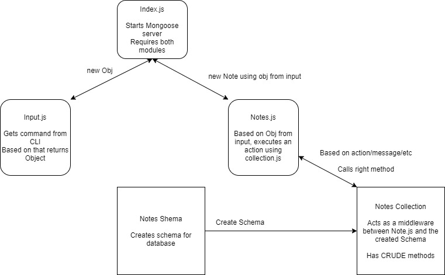

# Notesy

An application that lets you Create,Read and Delete notes from a mongoose Database.

## Journal:

Day1: Make the files and directories. Make the first two constructors of input and notes.

Day2: Convert functions and methods to ES6 classes, add tests for both js files.

Day3: Added mongodb and added add/list/delete methods to a collection, and use it as a middleware.

Day4: Wrote unit tests for the new collection, cleaned the code.

## Setup

- MONGODB_URI=mongodb://localhost:27017/notedb
## Running the app
- npm start
## Tests
- Unit Tests: npm run test
- Lint Tests: npm run lint

## UIM
(Made with diagrams)

